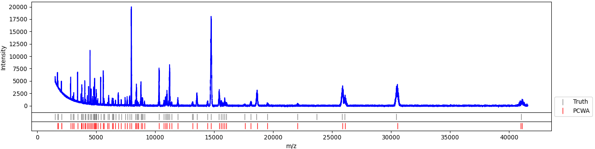

# PCWA
A highly parallel and fast event detector based on CWT transform. *PCWA* is a multiscale approache to find events with any shape with a mother wavelet that matches with events shape (details provided in the *Nature Communications* manuscript currently under review). Unlike previous CWT based peak finders, *PCWA* is able to fit with any user defined mother wavelet function, , by grouping and clustering initial candidate points (local maxima). The clustering step involves *Macro-* and *u-* clustering steps to break big data into smaller *M-clusters*. The clustering steps utilized **x-axis**, **scale-axis** and **coefficient values** all together to improve accuracy of located events.


## Requirements
- Python >= 3.8.5
- numpy >= 1.19.2
- scipy >= 1.6.2
- matplotlib >= 3.3.4
- h5py >= 2.10.0
- pandas >= 1.2.1

Most likely will work with older versions (Python > 3), not tested by the time of writing this document.

## How to use PCWA
*PCWA* is designed as a Python class and requires initializing. Import *pcwa* and initiate a new instant:

```python
import pcwa as pcwa

pcwa_analyzer = pcwa.PCWA(parallel=False)
# pcwa_analyzer.show_wavelets = True
pcwa_analyzer.w, pcwa_analyzer.h = 1.5, 1.5
pcwa_analyzer.selectivity = 0.7
pcwa_analyzer.use_scratchfile = False
```
properties can be set during or after initializing. A list of properties are as below:

## Properties
```python
dt = 1e5                               # sampling period of the signal in s
parallel = True                        # enable/disable multiprocessing 
mcluster = True                        # enable/disable macro-clustering
logscale = True                        # enable/disable logarithmic scale for scale-axis
wavelet = ['ricker']                   # list of wavelet function names
scales = [0.01e-3,0.1e-3,30]           # scale range and count in in s
selectivity = 0.5                      # minimum number of candidates in a valid micro-cluster
w = 2                                  # spreading factor in x-axis
h = 6                                  # spreading factor in y-axis (scale-axis)
extent = 1                             # global extent along x and y axis, used in macro-clustering
trace = None                           # trace (data) variable. 1D numpy vector
events = []                            # list of detected events (valid after calling detect_events() function)
cwt = {}                               # dictionary of cwt coefficients
wavelets = {}                          # dictionary of generated scaled&normalized 1D wavelet arrays
show_wavelets = False                  # plot wavelet functions
update_cwt = True                      # if False, will use the current cwt coefficients to detect events to save time tuning threshold parameters
keep_cwt = False                       # if False, will use less memory by running conv() and local_maxima() at the same time. Otherwise will generate entire CWT coefficient before looking for local maxima (conventional method)
use_scratchfile = False                 # stores cwt coefficients in the scarach file (hdf5 formatted) file
```

## Event Detection
After initializing, events can be detected by calling `detect_events()` method.

```python
events = pcwa_analyzer.detect_events(trace=data,wavelet=['ricker'],scales=[0.1e-3,1.0e-3,50],threshold=3)
tpr, fdr = pcwa.tprfdr(truth,events['loc'],e=7e-3/1e-5,MS=True) # e is the tolerance of error for event location, here 7ms/0.01ms (in data points), 0.01ms is the bin size
```
some of pcwa parameters can overridden when calling `detect_events()` by passing the following parameters:
- `trace`:        overrides the trace
- `wavelet`:      overrides wavelet functions
- `scales`:       overrides scales

`threshold` is the only parameter required at each call.


## Example Code
The example below shows how to use *PCWA* to detect peaks in a simulated mass spectroscopy data. 

```python
import numpy as np
import pandas as pd
import pcwa as pcwa
import matplotlib.pyplot as plt

# read the raw mass scpectroscopy data and truth values
df_raw = pd.read_csv('n100sig66_dataset_1_25/Dataset_14/RawSpectra/noisy22.txt',sep=' ')
df_true = pd.read_csv('n100sig66_dataset_1_25/Dataset_14/truePeaks/truth22.txt',sep=' ')

# create pcwa_analyzer object and set the desired parameters
pcwa_analyzer = pcwa.PCWA()
pcwa_analyzer.trace = df_raw['Intensity']
pcwa_analyzer.dt = 1
pcwa_analyzer.scales = [10,100,100]
pcwa_analyzer.wavelet = ['ricker']
pcwa_analyzer.keep_cwt = False
pcwa_analyzer.w, pcwa_analyzer.h = 0.2, 1
pcwa_analyzer.show_wavelets = False
pcwa_analyzer.use_scratchfile = False

# detect events (peaks)
events = pcwa_analyzer.detect_events(threshold=200)

# fine tune the location of detected peaks
loc = [int(e-events['scale'][n]+np.argmax(df_raw['Intensity'][int(e-events['scale'][n]):int(e+events['scale'][n])])) for n,e in enumerate(events['loc'])]

fig, ax = plt.subplots(3,1,figsize=(16,4),dpi=96,sharex=True,gridspec_kw={'height_ratios': [12,1,1]})
plt.subplots_adjust(hspace=0,wspace=0)
l0, = ax[1].plot(df_true['Mass'],df_true['Particles']*0, '|',markersize=10,color='gray',label='Truth')
ax[0].plot(df_raw['Mass'],df_raw['Intensity'],color='blue')
l1, = ax[2].plot(df_raw['Mass'].iloc[loc],[0]*len(loc),'|',markersize=10,color='red',label='PCWA')
ax[1].set_yticks([])
ax[1].set_ylim(0,0)
ax[2].set_yticks([])
ax[2].set_ylim(0,0)
ax[0].set_ylabel('Intensity')
ax[-1].set_xlabel('m/z')
plt.legend(handles=[l0,l1], bbox_to_anchor=(1.0, 4), loc='upper left')
plt.show()
```

Once the analysis is finished, the plot window should show the results as below:
>

If you want to calculate **TPR** and **FDR** value, useful for *ROC* plots, *PCWA* class provides a function to do that.
```python
true_peaks = np.sort(df_true['Mass'].to_numpy())
detected_peaks = np.sort(df_raw['Mass'].iloc[loc].to_numpy())
tpr, fdr = pcwa.tprfdr(true_peaks, detected_peaks, e=0.01, MS=True)
print(f"TPR={tpr:.3f}, FDR={fdr:.3f}")
```
> TPR=0.864, FDR=0.014

the command window should show the *TPR* and *FDR* values based on the ground truth values and acceptable error range (1% here). *MS* parameter determines the way of applying acceptable error, for mass spectroscopy data error is considered relative to mass value (). If `MS=False`, the absolute error value is considered.
The full example file is provided in this repository ([ms_example.py](https://github.com/vganjali/PCWA/blob/main/ms_example.py)).

## Reference
The provided dataset is a subset taken from the simulated Mass Spectroscopy dataset (DOI: [10.1093/bioinformatics/bti254](https://doi.org/10.1093/bioinformatics/bti254)).
